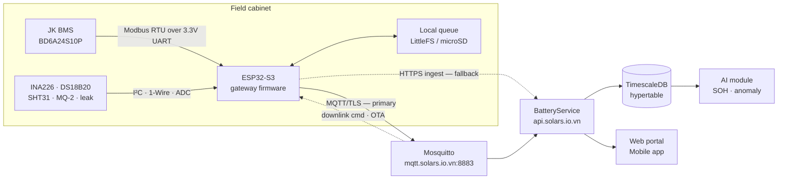
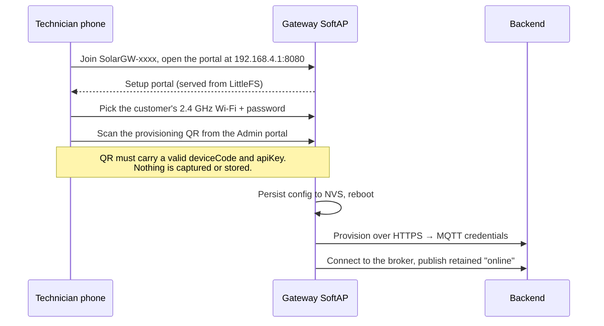

<div align="center">

# Solar Battery IoT — Edge Gateway

**ESP32-S3 gateway that reads a LiFePO₄ battery over the BMS UART and streams it to the cloud over MQTT/TLS — with an offline queue, remote commands and OTA.**

[](https://www.espressif.com/en/products/socs/esp32-s3)
[](https://platformio.org)
[](https://en.cppreference.com/w/cpp/17)
[](https://mqtt.org)
[](https://www.timescale.com)
[](.github/workflows/firmware-ci.yml)

</div>

---

The IoT track of the **Solar Lithium-ion Battery Maintenance Management System** (capstone GSU26SE55). This monorepo holds everything that runs *outside* the .NET backend: the ESP32-S3 firmware, the local development infrastructure, the Android provisioning app, the device simulator and the production deployment assets.

Readings flow **sensors → ESP32-S3 → MQTT/TLS (HTTPS fallback) → BatteryService → TimescaleDB → AI/SOH**, and come back as alerts, tickets and push notifications in the web and mobile clients.

## Table of contents

- [Data path](#data-path)
- [Repository layout](#repository-layout)
- [Hardware](#hardware)
- [Firmware architecture](#firmware-architecture)
- [Wire protocol](#wire-protocol)
- [Quick start](#quick-start)
- [PlatformIO environments](#platformio-environments)
- [Device provisioning](#device-provisioning)
- [Testing & CI](#testing--ci)
- [Production deployment](#production-deployment)
- [Roadmap](#roadmap)
- [Scope guard](#scope-guard)
- [Troubleshooting](#troubleshooting)
- [Contributing](#contributing)

---

## Data path



When the uplink drops, readings go to the local queue and are replayed on reconnect; every batch carries an `Idempotency-Key`, so a replayed batch is stored exactly once.

---

## Repository layout

```
iot/
├── firmware-esp32/          # ESP32-S3 firmware (C++17 · Arduino · PlatformIO)
│   ├── platformio.ini       # build envs: production, hardware, diagnostics, native tests
│   ├── include/             # config.example.h → config.h (gitignored) · config.prod.h
│   ├── src/                 # bms · sensor · net · queue · cmd · ota · portal · provision · ui
│   ├── examples/            # single-purpose diagnostic sketches
│   ├── data/                # LittleFS payload (CA cert, portal assets)
│   └── test/                # Unity unit tests (run on the host)
│
├── infra/                   # local dev stack — TimescaleDB · Redis · RabbitMQ · Mosquitto
│   ├── docker-compose.dev.yml · docker-compose.prod.yml
│   ├── setup.sh             # one-shot: .env + port check + up + verify
│   ├── db/init/             # SQL auto-run on first TimescaleDB boot
│   └── mqtt/                # broker config + ACL
│
├── provisioning-android/    # "Solar BMS Setup" — technician app (Kotlin/Gradle)
├── tools/
│   ├── simulator/           # esp32_simulator.py — device without hardware
│   ├── mock-backend/        # mock_backend.py — backend without the backend
│   └── sprint{1,3}-integration-test.sh
├── deploy/                  # Jenkins job templates + production runbook assets
├── docs/                    # glossary, procurement checklist, API contracts
└── *.md / *.csv             # specs: newiot.md · overall.iot.md · wiring-diagram.md · BOM
```

> The **BatteryService backend lives in a separate repository**. This track only speaks to it over HTTPS and MQTT.

---

## Hardware

| Subsystem | Part | Interface | Purpose |
| --- | --- | --- | --- |
| Compute | ESP32-S3-DevKitC-1 (N16R8 — 16 MB flash, 8 MB PSRAM) | — | Gateway firmware; PSRAM is needed for MQTT over TLS |
| Battery data | JK BMS (BD6A24S10P) | **Direct 3.3 V TTL UART** — ESP32 UART2, GPIO17/18, 115200 baud, Modbus RTU framing | Pack voltage, cell voltages, current, SOC, temperatures |
| Current / voltage | INA226 (200 A / 75 mV shunt) | I²C | Redundant measurement for cross-source validation |
| Pack temperature | DS18B20 | 1-Wire | Per-point temperature |
| Ambient | SHT31 | I²C | Cabinet temperature & humidity |
| Gas | MQ-2 | ADC | Electrolyte / smoke detection |
| Water | Leak probe | GPIO | Flood detection in the cabinet |
| Buffer | microSD (SPI) | SPI | Extended offline queue |
| Status | RGB status LED | GPIO | Device state at a glance: `Setup`, `Provisioning`, `WifiSearching`, `Online`, `Queued`, `Offline`, `Recovery` |

> [!NOTE]
> **The BMS link is a direct UART, not RS485.** The JK BD6A24S10P exposes a 3.3 V TTL UART, so the ESP32 talks to it pin-to-pin — no MAX485, no A/B pair, no termination resistors, and `BMS_RS485_DE_PIN = -1` because there is no driver-enable line to toggle. The protocol on that wire is still Modbus RTU (JK Modbus V1.1, sparse register map). The `BMS_RS485_*` macro names and the MAX485 multi-drop bus in [`wiring-diagram.md`](wiring-diagram.md) date from the original multi-pack design and are kept for the Sprint 5 goal of reading several packs; the current build reads **one** BMS (`BMS_UNIT_ID_COUNT = 1`).

Full bill of materials with pricing: [`hardware-bom.csv`](hardware-bom.csv), [`hardware-bom-budget.csv`](hardware-bom-budget.csv). Pin assignments: [`wiring-diagram.md`](wiring-diagram.md). Assembly: [`hardware-assembly-guide.md`](hardware-assembly-guide.md).

---

## Firmware architecture

`firmware-esp32/src/` is split so that everything decidable is decidable on a laptop — pure logic sits in headers and `core/`, and is unit-tested in the `native` environment without an ESP32 attached.

| Module | Responsibility |
| --- | --- |
| `bms/` | BMS abstraction: `mock_bms` for development, `modbus_bms` for real hardware, plus a pure register-map decoder |
| `sensor/` | INA226, DS18B20, SHT31, MQ-2, water leak, ambient reporting, environmental incident triggers |
| `net/` | Wi-Fi manager, NTP time sync, HTTPS client, MQTT client, TLS CA handling, exponential backoff, host resolver |
| `queue/` | Persistent local queue + index — survives reboot, replays on reconnect |
| `core/` | Pure logic: payload build, idempotency key, ingest policy & result, reading filter, retry gate, OTA/reprovision policies |
| `cmd/` | Downlink command handling, with the decision logic kept pure and testable |
| `ota/` | OTA check policy and firmware update |
| `provision/` + `portal/` | First-boot provisioning and the on-device captive-portal setup page |
| `config/` | NVS-backed runtime config: device identity, Wi-Fi, MQTT credentials, battery mapping |
| `cli/` | Serial command line for field diagnostics |
| `ui/` | Status LED palette and state machine |

---

## Wire protocol

**MQTT topics** (prefix `solar/{deviceCode}`):

| Topic | Direction | QoS / retain | Payload |
| --- | --- | --- | --- |
| `solar/{deviceCode}/{batterySerial}/telemetry` | publish | QoS 1 | Batched readings for one battery |
| `solar/{deviceCode}/heartbeat` | publish | QoS 1, no retain | Liveness + firmware/build info |
| `solar/{deviceCode}/status` | publish | QoS 1, **retained** | `online` / `offline` — also registered as the LWT, so a dropped gateway is visible immediately |
| `solar/{deviceCode}/cmd` | subscribe | QoS 1 | Downlink commands (reboot, re-read, OTA, config) |
| `solar/{deviceCode}/cmd/ack` | publish | QoS 1 | Command acknowledgement |

On connect the firmware publishes a retained `online` to override the broker-held LWT, then subscribes to its command topic.

**HTTPS fallback** — when the broker is unreachable, batches are POSTed to the ingest endpoint carrying an `Idempotency-Key`: a UUIDv4 from `esp_random()` (ESP32 RF entropy), which the backend dedupes on `(deviceCode, idempotencyKey)` for 24 hours. UUIDv4 is used rather than `deviceCode + epoch + seq` because several devices restarting before NTP has settled would otherwise collide. Partial-accept responses are parsed by `core/ingest_result`, and only the readings the backend did not take are retried.

---

## Quick start

### 1 · Local infrastructure

```bash
cd infra
./setup.sh          # writes .env, checks ports, brings the stack up, verifies each service
```

Brings up TimescaleDB, Redis, RabbitMQ and Mosquitto. Per-service verification and troubleshooting: [`infra/README.md`](infra/README.md).

### 2 · Firmware

```bash
cd firmware-esp32
cp include/config.example.h include/config.h     # set WIFI_SSID / WIFI_PASSWORD / endpoints
pio run                                          # build the default environment
pio run -t upload                                # flash
pio run -t uploadfs                              # flash the LittleFS image (CA cert, portal assets)
pio device monitor -b 115200                     # serial console
```

`include/config.h` is **gitignored** — it holds per-device secrets. `config.example.h` is the template CI builds against.

### 3 · No hardware? Simulate it

```bash
python tools/simulator/esp32_simulator.py        # a device: telemetry, heartbeat, status, commands
python tools/mock-backend/mock_backend.py        # a backend: ingest + provisioning endpoints
bash tools/sprint3-integration-test.sh           # end-to-end resilience checks
```

---

## PlatformIO environments

| Environment | What it is for |
| --- | --- |
| `esp32-s3-devkitc-1` | **Default.** Full firmware with the mock BMS — the one CI builds |
| `esp32-s3-real` | Same, with `USE_MOCK_BMS=0` — compiles the real Modbus/I²C/1-Wire paths |
| `esp32-s3-uartlog` | Logs over UART0 instead of USB-CDC — use when the native USB port is silent and you need boot logs |
| `esp32-s3-real-uartlog` | Real hardware **and** UART logging — the everyday environment while wiring the cabinet |
| `native` | Unity unit tests on the host: payload, backoff, command logic, BMS register map, CA parsing, reading filter, ingest result |
| `example-blink` / `esp32-s3-blink-uart` | Minimal sketch — separates "board or bootloader is broken" from "app code is broken" |
| `esp32-s3-modbus-scan` | Sweeps baud rates and register addresses when the BMS times out but the wiring looks right |
| `esp32-s3-i2c-scan` | Scans the I²C bus when INA226 and SHT31 both fail — proves whether the bus is alive |
| `esp32-s3-uart-sniff` | Passively listens to the BMS UART across baud rates and prints hex |
| `esp32-s3-jk-probe` | Actively probes a JK BMS when the passive sniffer stays silent |
| `esp32-s3-sd-card-test` | Isolated SD/SdFat diagnostic with Wi-Fi, BMS and the queue excluded |

```bash
pio run -e esp32-s3-real-uartlog -t upload --upload-port COM5
pio test -e native --verbose
```

---

## Device provisioning

A technician pairs a gateway with the production system using the Android app in [`provisioning-android/`](provisioning-android/README.md) — the phone is only involved during setup; afterwards the ESP32 joins the customer's Wi-Fi on its own.



Build the app:

```powershell
$env:ANDROID_HOME='C:\Users\<you>\AppData\Local\Android\Sdk'
gradle :app:assembleDebug     # → app/build/outputs/apk/debug/app-debug.apk
```

---

## Testing & CI

[`.github/workflows/firmware-ci.yml`](.github/workflows/firmware-ci.yml) runs on every push:

1. **Native unit tests** — `pio test -e native`, executed on the runner with no hardware attached.
2. **Regression guard** — the workflow asserts a minimum test count, so deleting tests to make CI green fails the build.
3. **Firmware build** — stubs `config.h` from `config.example.h` and compiles the ESP32-S3 target.

Pure logic is deliberately kept out of the Arduino layer precisely so it can be covered here: payload construction, backoff, idempotency keys, ingest results, command decisions and the BMS register decoder are all plain C++.

---

## Production deployment

`Jenkinsfile` runs firmware CI; `deploy/jenkins/production.Jenkinsfile.example` is the template for the central signing/deploy job. Mosquitto runs from `infra/docker-compose.prod.yml` on the same VPS as the backend K3s cluster, but stays outside its Docker/K3s network.

First-time order of operations:

1. Deploy the backend K3s so cert-manager issues the `mqtt.solars.io.vn` certificate.
2. Run the systemd MQTT TLS sync from the backend repository.
3. Fill `/opt/solar-iot/config/host.env` and `/opt/solar-iot/secrets/runtime.env` from their `.example` files — the MQTT password must match the backend's `Mqtt__Password`.
4. Run the `main` pipeline; a green CI triggers the central `solar-iot-production` job.

Production firmware uses `https://api.solars.io.vn` as the HTTPS fallback and `mqtt.solars.io.vn:8883` as the TLS broker. Those endpoints are public and not secret — the pipeline **fails** if `config.example.h` drifts back to placeholder domains. `deviceCode`, API key, MQTT password, Wi-Fi and AP/portal passwords stay per-device and must be provisioned into NVS before a unit ships.

Full runbook: `PRODUCTION_DEPLOYMENT_BACKEND_IOT.md` in the backend repository. See also [`deploy/README.md`](deploy/README.md).

---

## Roadmap

| Sprint | Theme | Demonstrable outcome |
| --- | --- | --- |
| **S0** | Foundation & procurement | Repo + Docker stack up, ESP32 printing NTP time |
| **S1** | MVP mock over HTTPS | Mock readings from the ESP32 on a live dashboard |
| **S2** | Device management | Admin creates a device; firmware provisions and heartbeats |
| **S3** | Resilience & production contract | 5 minutes offline loses nothing; `Idempotency-Key` end to end |
| **S4** | MQTT broker & bridge | MQTT over TLS, LWT gives instant offline detection |
| **S5** | Hardware integration | Real BMS read end to end — today one pack over the direct UART; the plan targets four over an RS485 multi-drop bus |
| **S6** | Anomaly · cross-source · notification | Threshold breach → alert → ticket → push |
| **S7** | Calibration · OTA · observability | Remote firmware update, Grafana panels |
| **S8** | Pilot · demo · runbook | Enclosure + UPS + 4G, recorded demo |

Sprints run in parallel rather than strictly in sequence, and no sprint is uniformly finished — every one carries a mix of ✅ done, 🟡 code complete but not yet verified on hardware, and 🔴 open gaps. **[`tasksprint.md`](tasksprint.md) §4 is the single source of truth for status**, task by task; this table only names the themes. The firmware currently reports itself as `0.1.0-sprint4`, with the Sprint 5 hardware paths present and buildable (`esp32-s3-real`).

---

## Scope guard

> [!WARNING]
> **ADR-017 — no energy analytics.** Do not add kWh, savings, carbon or charge-cycle dashboards. INA226 exists for cross-source validation only and must never be integrated into energy totals. Backend CI blocks the keywords `EnergySession|EnergyKwh|CapacityKw|CarbonEmission|…`. Rationale: [`tasksprint.md`](tasksprint.md) §0.

---

## Troubleshooting

<details>
<summary><b>Silent reset / infinite boot loop right after flashing</b></summary>

Flash size must be declared in **both** `board_build.flash_size` and `board_upload.*`. With only one of them, the bootloader header and the partition table disagree, and the chip resets inside the bootloader before any log is emitted.

</details>

<details>
<summary><b>Firmware reports "CA cert does not exist" although the file is in <code>data/</code></b></summary>

Set `board_build.filesystem = littlefs` for the environment. Without it, `pio run -t uploadfs` packs a SPIFFS image; the chip writes it to the right partition, but the firmware mounts LittleFS and cannot read a thing.

</details>

<details>
<summary><b>Panic: "Unhandled debug exception" in the middle of a TLS request</b></summary>

`CORE_DEBUG_LEVEL=5` makes `HTTPClient` call `vsnprintf` on an already-tight 8 KB `loop()` stack, tripping the end-of-stack watchpoint. Ship at level 3 (the project default) and raise it temporarily from the command line — `-DCORE_DEBUG_LEVEL=5` — only while inspecting a driver. Level 5 also floods UART so hard that the firmware's own `[wifi]`/`[mqtt]`/`[ingest]` lines get lost.

</details>

<details>
<summary><b><code>setMaxCurrentShunt()</code> returns <code>INA226_ERR_SHUNT_LOW</code> (0x8002)</b></summary>

The library's `INA226_MINIMAL_SHUNT_OHM` defaults to 0.001 Ω and rejects anything smaller; the project's 200 A / 75 mV shunt is 0.000375 Ω. The constant is `#ifndef`-guarded, so the build flag `-DINA226_MINIMAL_SHUNT_OHM=0.0001` overrides it — no fork required.

</details>

<details>
<summary><b>MQTT publishes fail on larger batches</b></summary>

`PubSubClient` defaults to a 256-byte buffer; a production telemetry batch is around 1.5 KB. The build sets `MQTT_MAX_PACKET_SIZE=4096` (plus `MQTT_SOCKET_TIMEOUT=15`) — keep those flags when adding a new environment.

</details>

<details>
<summary><b>Panic during PSRAM init on a blink/diagnostic environment</b></summary>

Diagnostic environments must **not** `extends` the main environment: it forces octal PSRAM onto a board definition without PSRAM, which panics at init and boot-loops. The blink and scan environments declare their own minimal flags for exactly this reason.

</details>

<details>
<summary><b>BMS times out (0xE2) although the wiring is correct</b></summary>

Work down the ladder: `esp32-s3-uart-sniff` (is the BMS transmitting at all?) → `esp32-s3-jk-probe` (does it answer when asked?) → `esp32-s3-modbus-scan` (which baud rate and register base?). Also confirm `BMS_MODEL=3` — the hardware environments force it, because `include/config.h` is gitignored and cannot be trusted to carry it.

</details>

---

## Contributing

- One issue → one branch: `feat/GH-<n>-slug`, `fix/…`, `chore/…`
- Commits: `type(#<issue>): description`
- Plan before coding, then review, test and ship — see `.claude/rules/workflow.md`
- Never commit `include/config.h`, `infra/.env` or any per-device secret

---

<div align="center">

Capstone **GSU26SE55** · supervisor **Trương Long** · BE · FE · AI · IoT

</div>
